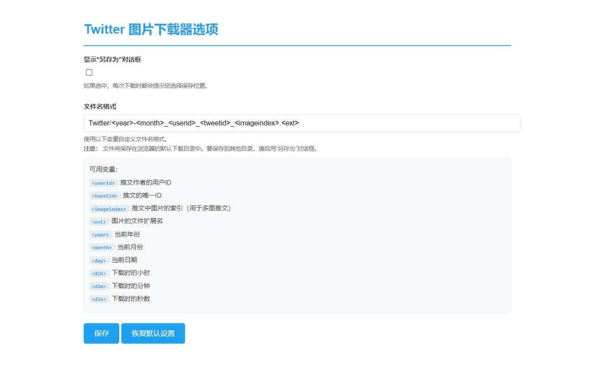

# Twitter Image Downloader

一个简单易用的Chrome扩展程序，用于下载Twitter上的图片。

## 功能特点

- 一键下载Twitter帖子中的图片
- 自定义文件名格式
- 支持批量下载
- 可选择是否显示"另存为"对话框
- 支持中英文界面切换
- 支持自定义保存路径和子文件夹

## 功能演示

## 安装方法

### 方法一：Chrome 应用商店安装（推荐）

[点击此处访问 Chrome 应用商店](https://chromewebstore.google.com/detail/%E6%8E%A8%E7%89%B9%E5%9B%BE%E7%89%87%E4%B8%8B%E8%BD%BD%E5%99%A8/kfmhanpmpfkbcemeokhhjmeodebcbbgm)，点击"添加至 Chrome"即可安装。

### 方法二：开发者模式安装

如果您无法访问 Chrome 应用商店，可以通过以下步骤手动安装：

1. 点击本页面右侧的 "Releases"，下载最新版本的源代码
2. 解压下载的文件
3. 打开 Chrome 浏览器，在地址栏输入：`chrome://extensions/`
4. 开启右上角的"开发者模式"
5. 点击"加载已解压的扩展程序"
6. 选择解压后的 `src` 文件夹

> 注意：通过开发者模式安装的扩展程序，Chrome 可能会提示"移除危险扩展程序"，这是正常现象。如果不希望看到此提示，建议通过 Chrome 应用商店安装。

## 使用说明

1. 安装完成后，在Twitter页面上会出现下载按钮
2. 点击下载按钮即可保存图片
3. 通过扩展程序的选项页面可以：
   - 设置是否显示"另存为"对话框
   - 自定义文件名格式
   - 设置保存路径

### 文件名格式变量

可以使用以下变量来自定义文件名格式：
- `<year>` - 发推年份
- `<month>` - 发推月份
- `<day>` - 发推日期
- `<username>` - 用户名
- `<userid>` - 用户ID
- `<tweetid>` - 推文ID
- `<imageindex>` - 图片序号
- `<ext>` - 文件扩展名

例如：`Twitter/<username>/<year>-<month>-<day>-<imageindex>.<ext>`

## 支持的语言

- 英文 (English)
- 中文 (Chinese)

## 隐私说明

本扩展程序：
- 不会收集任何个人信息
- 不会向任何服务器发送数据
- 仅在Twitter网站上运行

## 许可证

MIT License

## 问题反馈

如果您在使用过程中遇到任何问题，或有任何建议，请在GitHub上提交Issue。
